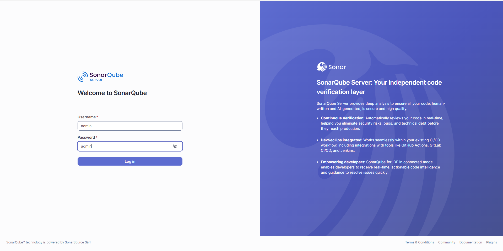

# Zord Infrastructure AWS

This repository provisions the AWS infrastructure for the EKS environment and boots an admin EC2 instance with Jenkins and SonarQube using Docker.

It also installs External Secrets Operator automatically after a successful EKS apply.

## Deployment Method

This project is primarily managed through GitHub Actions, not by running Terraform manually on your local machine.

The workflow file is:

```text
/.github/workflows/eks-terraform.yml
```

There is now a second Terraform stack for AWS Secrets Manager:

```text
/secret-manager
```

And its workflow file is:

```text
/.github/workflows/secrets-manager-terraform.yml
```

## Recommended Run Order

Run the infrastructure in this order:

1. `Secret Manager Terraform` with `apply`
2. `EKS Terraform` with `apply`
3. deploy the Kubernetes manifests from the app repository

That order matters because:

- the app repo expects AWS Secrets Manager secrets to already exist
- the EKS workflow installs External Secrets Operator automatically
- the app repo `ExternalSecret` resources need both AWS secrets and the operator

## Workflow Trigger Rules

This workflow works like this:

1. Pull request trigger  
   If you create or update a pull request with changes inside `EKS-terraform`, the pipeline runs automatically.

2. Manual trigger  
   You can open GitHub Actions and run the workflow manually whenever you want.

Important:

- It does not auto-trigger on `main`
- It does not auto-trigger on `master`
- It only auto-triggers on pull requests

## Manual Workflow Options

When you run the workflow manually, you can choose:

- `plan`
- `apply`
- `destroy`

If you select `destroy`, then you must set:

```text
confirm_destroy = yes
```

That will delete the entire Terraform-managed cluster and its related resources.

## GitHub Repository Secrets

Open:

```text
GitHub Repository -> Settings -> Secrets and variables -> Actions
```

Add these repository secrets:

1. `AWS_ACCESS_KEY_ID`  
   Your AWS access key ID

2. `AWS_SECRET_ACCESS_KEY`  
   Your AWS secret access key

3. `TF_STATE_BUCKET`  
   The S3 bucket name used to store Terraform state

4. `ZORD_APP_SECRETS_JSON`
   One JSON string for the `zord/app-secrets` AWS secret

5. `ZORD_EDGE_SIGNING_KEY_JSON`
   One JSON string for the `zord/edge-signing-key` AWS secret

The workflow currently uses region:

```text
ap-south-1
```

## Create S3 Bucket For Terraform State

Use a globally unique bucket name.

Example:

```bash
aws s3api create-bucket --bucket my-eks-terraform-state-bucket --region ap-south-1
```

Enable versioning:

```bash
aws s3api put-bucket-versioning \
  --bucket my-eks-terraform-state-bucket \
  --versioning-configuration Status=Enabled
```

Enable default encryption:

```bash
aws s3api put-bucket-encryption \
  --bucket my-eks-terraform-state-bucket \
  --server-side-encryption-configuration '{"Rules":[{"ApplyServerSideEncryptionByDefault":{"SSEAlgorithm":"AES256"}}]}'
```

Block public access:

```bash
aws s3api put-public-access-block \
  --bucket my-eks-terraform-state-bucket \
  --public-access-block-configuration BlockPublicAcls=true,IgnorePublicAcls=true,BlockPublicPolicy=true,RestrictPublicBuckets=true
```

Then store the bucket name in GitHub as:

```text
TF_STATE_BUCKET
```

Terraform state key used by the workflow:

```text
eks/terraform.tfstate
```

## How Terraform State Is Stored

This Terraform configuration uses an S3 backend.

GitHub Actions runs Terraform with:

- S3 bucket from `TF_STATE_BUCKET`
- region `ap-south-1`
- state key `eks/terraform.tfstate`
- encryption enabled

This means the Terraform state is stored remotely in S3, not inside the GitHub runner.

## How To Run The Workflow Manually

Go to:

```text
GitHub Repository -> Actions -> EKS Terraform -> Run workflow
```

Then choose:

- `plan` to see changes
- `apply` to deploy the cluster
- `destroy` to delete the cluster

If you choose `destroy`, set:

```text
confirm_destroy = yes
```

## How To Deploy The Cluster Through GitHub Actions

1. Push your code to GitHub
2. Open `Actions`
3. Select `EKS Terraform`
4. Click `Run workflow`
5. Choose `apply`
6. Run the workflow

The workflow will:

- check Terraform formatting
- initialize the S3 backend
- validate Terraform
- apply the EKS Terraform code
- install Cluster Autoscaler
- install External Secrets Operator

## How To Delete The Entire Cluster Through GitHub Actions

1. Open `Actions`
2. Select `EKS Terraform`
3. Click `Run workflow`
4. Choose `destroy`
5. Set `confirm_destroy` to `yes`
6. Run the workflow

Terraform will destroy all resources managed by this folder.

## Local Terraform Commands

If needed, you can still run Terraform locally from the `EKS-terraform` folder:

```bash
cd EKS-terraform

terraform init \
  -backend-config="bucket=<your-tf-state-bucket>" \
  -backend-config="key=eks/terraform.tfstate" \
  -backend-config="region=ap-south-1" \
  -backend-config="encrypt=true"

terraform plan
terraform apply
```

If you only want to recreate the admin EC2 instance and rerun `tool.sh`, use:

```bash
terraform apply -replace=aws_instance.eks
```

To destroy all infrastructure manually:

```bash
terraform destroy
```

## Get EC2 Public IP

After `terraform apply` or after a successful GitHub Actions apply, get the EC2 public IP:

```bash
aws ec2 describe-instances --region ap-south-1 \
  --query "Reservations[*].Instances[*].[InstanceId,PublicIpAddress,State.Name]" \
  --output table
```

You can also get it from Terraform output:

```bash
terraform output ec2_public_ip
```

## Access Jenkins

Open Jenkins in your browser:

```text
http://<EC2-PUBLIC-IP>:7777
```

Jenkins runs in Docker with this port mapping:

```text
7777 -> 8080
```

## Access SonarQube

Open SonarQube in your browser:

```text
http://<EC2-PUBLIC-IP>:7771
```

SonarQube runs in Docker with this port mapping:

```text
7771 -> 9000
```

SonarQube screen reference:



## SSH Into EC2

Connect to the admin EC2 instance:

```bash
ssh -i <your-key.pem> ec2-user@<EC2-PUBLIC-IP>
```

## Jenkins Initial Admin Password

To read the Jenkins initial admin password from EC2:

```bash
cat /home/ec2-user/jenkins-initial-admin-password
```

If that file is not present, read it directly from the Jenkins container:

```bash
sudo docker exec jenkins cat /var/jenkins_home/secrets/initialAdminPassword
```

## Useful Checks On EC2

Check running containers:

```bash
sudo docker ps
```

Check Jenkins logs:

```bash
sudo docker logs jenkins --tail 50
```

Check SonarQube logs:

```bash
sudo docker logs sonarqube --tail 50
```

Check bootstrap logs:

```bash
sudo cat /var/log/tool-bootstrap.log
```

Check Jenkins locally on the instance:

```bash
curl http://localhost:7777
```

Check SonarQube locally on the instance:

```bash
curl http://localhost:7771
```

## Notes

- Pull requests trigger the pipeline automatically
- Push to `main` or `master` does not trigger the workflow
- Manual workflow run is required for actual deployment or deletion
- The S3 bucket must exist before running the workflow
- Jenkins is started by `EKS-terraform/tool.sh`
- SonarQube is started by `EKS-terraform/tool.sh`
- External Secrets Operator is installed by the EKS workflow after apply
- If `tool.sh` changes, Terraform is configured to replace the admin EC2 instance and rerun bootstrap
